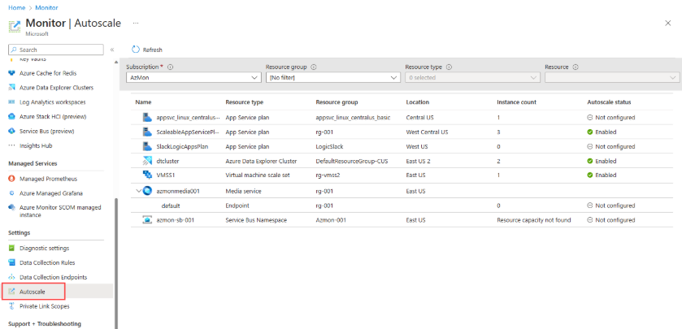
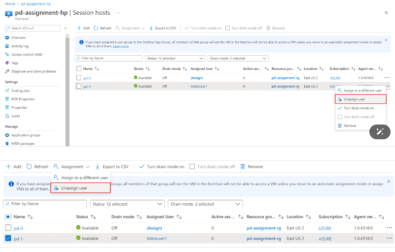
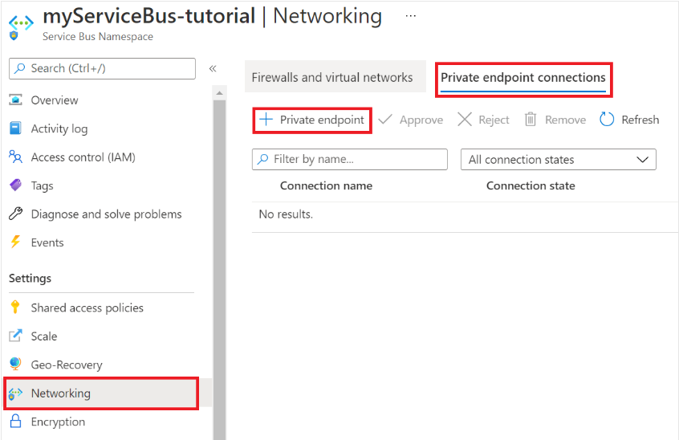

# Configurando Recursos e Dimensionamentos em Máquinas Virtuais na Azure

Este guia explora a configuração prática de recursos e dimensionamentos em Máquinas Virtuais no Microsoft Azure, a partir da interface do portal. São apresentados os passos para criação de uma máquina virtual, configuração de conjuntos de dimensionamento (scale sets), criação de pool de hosts para área de trabalho virtual, e implantação de aplicativos de função (Azure Functions).

## Criando uma Máquina Virtual no Azure

Para iniciar a criação de uma VM no portal do Azure, o primeiro passo é escolher a opção “Máquina Virtual” e selecionar uma assinatura e grupo de recursos. O usuário define o nome da VM, a região (com a possibilidade de alterar), e o tipo de ambiente (teste, desenvolvimento ou produção). É possível escolher modelos predefinidos com configurações otimizadas, como séries F para memória intensiva ou modelos com aplicações pré-instaladas, como Linux com WordPress.

O processo segue com a definição de disponibilidade (sem redundância, zona de disponibilidade ou conjunto de disponibilidade). O usuário pode optar por instâncias spot (mais baratas, mas instáveis) e selecionar o tamanho da VM (famílias como B, D, E, M, entre outras, com foco em diferentes cargas de trabalho). Uma boa prática é consultar os tamanhos compatíveis diretamente no portal para não errar na escolha.

É necessário definir credenciais, portas de entrada (como 3389 para RDP), tipo de disco (Standard ou Premium), ativar opção de excluir recursos associados à VM, configurar rede virtual e segurança. O desligamento automático pode ser agendado, e notificações por e-mail configuradas.

A VM pode ser vinculada ao Active Directory e ter backup ativado via Recovery Vault. Monitoramento e diagnósticos podem ser ajustados, além da instalação de extensões no momento do provisionamento. Após revisão geral, a VM é criada com os recursos definidos.

## Criando Conjunto de Dimensionamento (Scale Set)

O Scale Set permite criar e gerenciar um grupo de VMs idênticas, que escalam automaticamente conforme a demanda. Ao configurar um Scale Set, define-se o número inicial de instâncias, o limite máximo e as métricas que dispararão escalabilidade, como uso médio de CPU acima de 80%. A diminuição também pode ser ajustada, com base em thresholds como CPU abaixo de 40%.

O dimensionamento pode ser manual ou automático, e a orquestração pode ser configurada como flexível. Esses ajustes são essenciais para cenários como Black Friday, onde a demanda por processamento aumenta rapidamente. A opção de consulta padrão (duração de análise) também influencia nas decisões de escalonamento.

## Criando Pool de Hosts na Área de Trabalho Virtual

Ao utilizar o Azure Virtual Desktop, pode-se optar por máquinas individuais ou criar um pool de hosts para múltiplos usuários. Um pool permite balancear a carga com base no número de sessões por máquina. Ideal para cenários em que diversos colaboradores compartilham a mesma máquina, sem interferência entre eles.

Durante a criação do pool, define-se nome, grupo de recursos, tipo de carga, número máximo de usuários por host, e se as VMs serão adicionadas automaticamente. Esse modelo é mais econômico e escalável, indicado quando não há necessidade de personalizações específicas por usuário.

## Aplicativo de Função (Azure Functions)

As Azure Functions são pequenas aplicações executadas sob demanda, sem necessidade de servidor dedicado. Na criação, define-se o nome, sistema operacional (Linux ou Windows), linguagem (C#, Python, JavaScript, etc.), plano de consumo (sem servidor) ou dedicado, e tipo de armazenamento.

Um ponto importante é a escolha do runtime: cada linguagem pode exigir um SO específico. Por exemplo, funções em Python operam com Linux, enquanto C# pode rodar em Windows. O conhecimento dessas limitações é essencial em provas de certificação e na arquitetura de soluções reais.

## Exemplos Visuais

**Famílias de VMs**:

| Família | Uso Principal | Exemplo |
|--------|----------------|---------|
| B | Baixo custo/testes | b1s, b2ms |
| D | Uso geral | d2s_v3 |
| E | Alta memória | e4s_v3 |
| F | CPU intensiva | f4s |
| M | Banco de dados grandes | m128ms |

**Exemplo de Dimensionamento**:

**Exemplo de Pool de Hosts**:

**Exemplo de Azure Functions Flow**:

## Questões Objetivas

1. Qual das opções representa uma boa prática ao configurar uma máquina virtual para testes no Azure?
   - A) Utilizar discos premium sempre.  
   - B) Criar com redundância geográfica ativada.  
   - C) Ativar exclusão automática de recursos relacionados.  
   - D) Desativar notificações de desligamento.  
   - E) Deixar todas as portas de entrada abertas.  
   **Resposta: C**

2. O que define a escalabilidade automática em um conjunto de dimensionamento no Azure?
   - A) Número de usuários conectados.  
   - B) Quantidade de RAM disponível.  
   - C) Uso médio de CPU e políticas de crescimento/redução.  
   - D) Horário de funcionamento do datacenter.  
   - E) Tipo de sistema operacional utilizado.  
   **Resposta: C**

3. Qual alternativa descreve corretamente uma função do Azure Function?
   - A) Executa apenas scripts Python para análise de dados.  
   - B) Requer sempre um servidor dedicado.  
   - C) Permite execução sob demanda com base em eventos.  
   - D) Não pode ser usada com containers.  
   - E) Substitui todas as máquinas virtuais em produção.  
   **Resposta: C**
